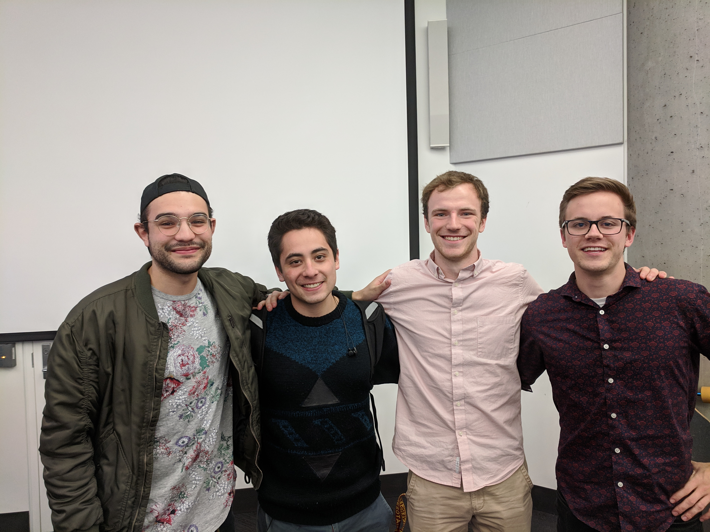

+++
template = "finalists.html"
sort_by = "date"
title = "Event Finalists"
+++

# Event Finalists

## Software Design Competition

The **Software Design Competition** (SDC) is an annual event where students
work in teams to design software solutions to a prompt. This year the
prompt for SDC was:
    
> Citizens are frequently told to be civically engaged: involved in their communities, registered to vote, donating to nonprofits, etc. Many people find it to fulfill all of these responsibilities.
> You are tasked with first designing, and then building a software application or service that can help foster civic engagement. That is, your program should people fulfill their civic duties and interact productively with their government.

This year we added a week to the competition to give students a chance to
implement their design. We saw many great ideas ranging from Tinder for
politicians to an app that helps organizations reach volunteers. The
competition was close but in the end two teams came out on top. 

### First Place Overall: Polliato

This app was designed to help voters connect with the politicians on their
ballot. Based on the users home of record, it created a ballot identical to
what one would see the day they vote. One could then click
on each candidate and it would show the candidates contact information
and social media feed. Then one could keep track of which candidate they
would vote for when it came time to hit the polls. 

From the left: Marcus Virginia, Kevin Maldonado, Alec Lorimer, Samuel Hanson

"This idea came to us after we all agreed, that most of the time, we were very ill-informed about the candidates we were voting for. Then in came Polliato. We wanted an easy way to get updates about candidates we cared about, and learn about candidates we have never heard about."

-Marcus

### Second Place Overall: MOB

The MOB team submitted a web app that is just as likely to inspire as it
is to incite. A creative approach to the prompt, this application allows
users to form 'mobs' and get groups of people together for events. Users
create an event, others can join in on the mob and follow the activities of
other users. It is functional here: mob2018.herokuapp.com/

From the left: Charlie Vuong, Lukas Kelsey-Friedemann

"Our approach was to take the ideals and political causes of individuals and fascilitate taking action. We want people to get excited about their movements and ideals, and hopefully get other people behind their mobs as well."

-Lukas, Creative Director
